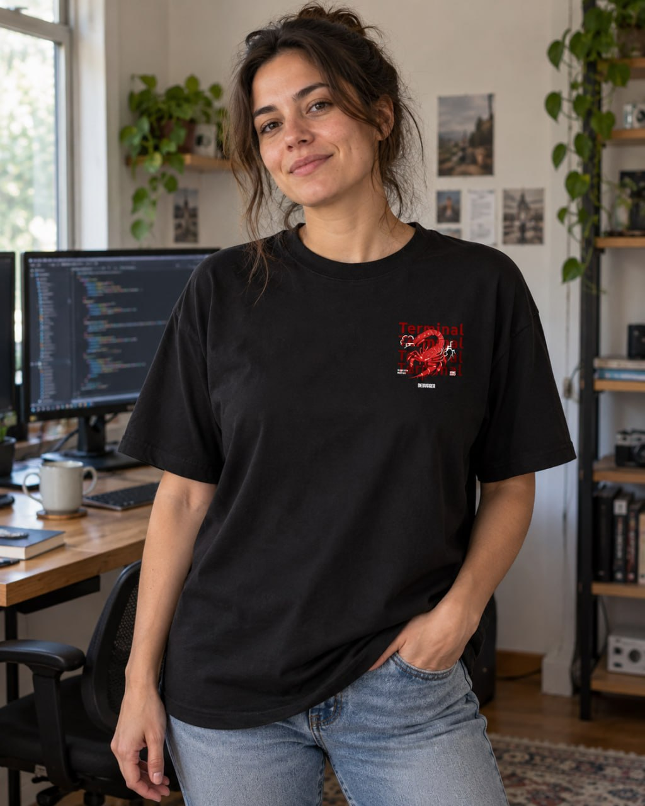
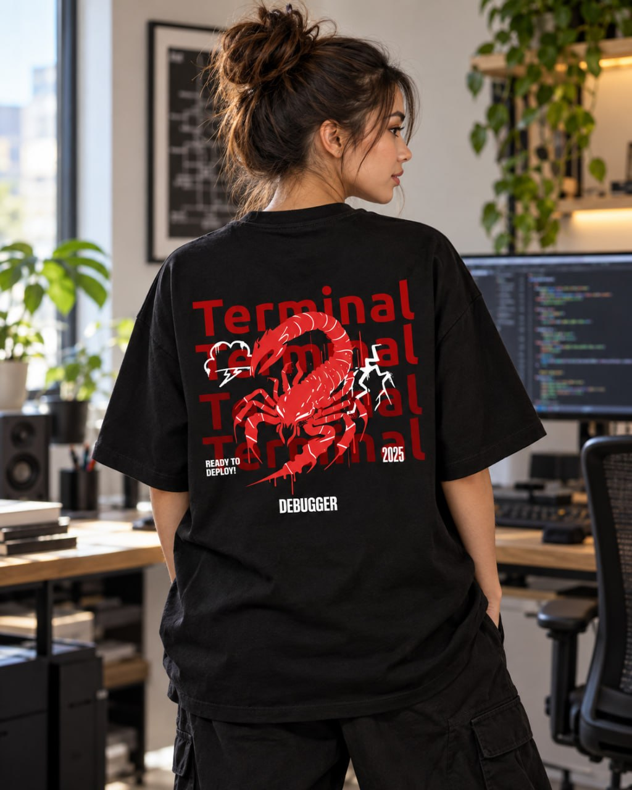
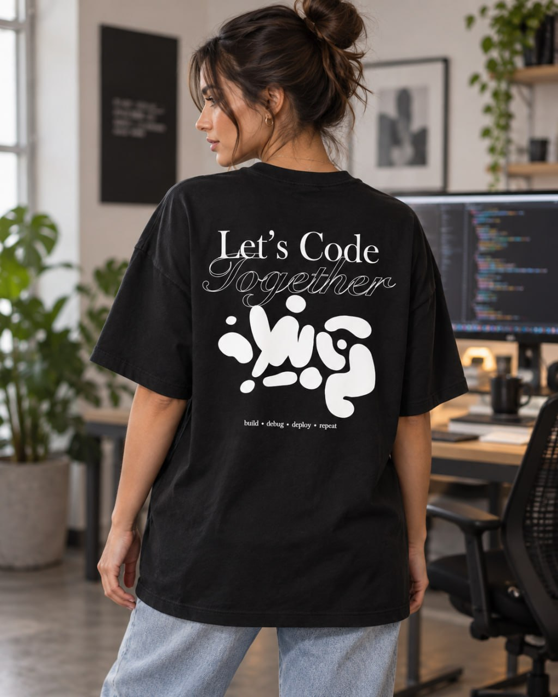

# which-tee-are-you 🧠👕

A tiny quiz for developers. Answer 5 questions about your coding habits, get matched to a t-shirt.

Built this because I was making dev-themed tees for [GemZy](https://gemzy.co.in) and got nerd-sniped into writing a quiz instead of just... selling them like a normal person.

## Run it

```bash
python quiz.py
```

No dependencies. Stdlib only. ~60 lines.

## The quiz

```
$ python quiz.py

1. Your commit messages are usually:
   a) "fix bug"
   b) A haiku about the bug
   c) 500 words explaining why it wasn't really a bug

2. It's Friday 5pm. There's a hotfix ready.
   a) Ship it. YOLO.
   b) Ship it, but I whisper "sorry" to production
   c) Absolutely not, see you Monday

3. Your IDE theme is:
   a) Whatever came default, I don't care
   b) Something with "dracula" or "midnight" in the name
   c) I have 6 themes and switch based on mood

4. When something breaks in prod:
   a) git blame, find the human responsible
   b) "It works on my machine" energy
   c) Cry, then fix it, then cry again

5. Your relationship with AI-assisted coding:
   a) I ask it to write the whole thing and pray
   b) I use it for boilerplate, I write the logic
   c) I read the output line by line before I run it
```

## Results

| Result | Shirt | Link |
|---|---|---|
| Terminal Debugger | Ready to deploy, always | [Buy](https://gemzy.co.in/en/products/terminal-debugger-black) |
| It Works on My Machine | Chaotic but honest | [Buy](https://gemzy.co.in/en/products/it-works-on-my-machine-black) |
| Code Trust The Process | You know what you're doing | [Buy](https://gemzy.co.in/en/products/code-trust-the-process-white) |
| ERROR 404: Sleep Not Found | Shipped at 2am, will do it again | [Buy](https://gemzy.co.in/en/products/error-404-sleep-not-found-black) |

## The actual shirts

Real 240GSM cotton, actually printed, actually shippable (India only for now). ₹499 each.

<p align="center">
  
  
</p>

**Terminal Debugger** — red scorpion, "Terminal" repeated across the back, "Ready to Deploy" text.

<p align="center">
  
</p>

**Let's Code Together** — for pair programmers who dress like it.

More designs (and the quiz results for all 4 types) at **[gemzy.co.in](https://gemzy.co.in)**.

## Why does this exist

I make dev merch on the side. Writing a normal landing page felt boring, so I wrote a quiz instead. If you got this far, you're exactly the kind of person GemZy is for. No pressure, just vibes and cotton.

> Current vibe in Indian dev communities: *"I had no idea what I was building. Now I have no idea what's broken."* — Vibe Debugging, 2026.

## License

MIT for the quiz code. Don't reprint the designs and sell them, that's just rude.
